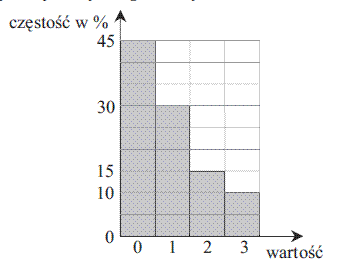
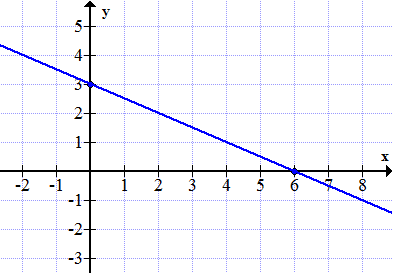

# Statistics tutoring for ML Master's degree - 04/04/2024

## Exercise 1

Średnia artymetyczna zbioru liczb $X$ wynosi $\overline{x}=5$. Liczby te wynoszą kolejno $X={4, 12, 6, 10, 5, x+12, 5, 10, 2x, 2, 1, 11}$. Oblicz wartość $x$.

## Exercise 2

Średnia wieku w pewnej grupie studentów jest równa $\overline{w}=23$ lata. Średnia wieku tych studentów i ich opiekuna jest równa $\overline{w^\prime}=24$ lata. Opiekun ma $w_o=39$ lat. Oblicz, ilu studentów jest w tej grupie.

## Exercise 3

{ width=200px}

Oblicz na podstawie powyższego wykresu **częstości** średnią arytmetyczną przedstawionych wartości.

## Exercise 4

Na jednym z wydziałów Akademii Ekonomicznej podczas rekrutacji na pierwszy rok studiów bierze się pod uwagę wyniki pisemnego egzaminu maturalnego.
Wagi dla poszczególnych przedmiotów: matematyka – 0,65; geografia – 0,2; język obcy nowożytny – 0,15.

Kandydat na studia musi uzyskać co najmniej 40 punktów, aby zostać przyjętym.

Dwoje znajomych, Ela i Jacek ubiega się o przyjęcie do Akademii Ekonomicznej na ten wydział. Uzyskali następujące wyniki:

- Ela: matematyka – 40, geografia – 45, język obcy nowożytny – 35
- Jacek: matematyka – 45, geografia – 40, język obcy nowożytny – 40

Kto z nich zostanie przyjęty na studia?

## Exercise 5

W czterech rzutach sześcienną kostką do gry otrzymano następujące liczby oczek: 6,3, 1, 4. Oblicz medianę tych wartości.

## Exercise 6

O liczbie $x$ wiadomo, że $\log_3x=9$. Oblicz wartość $x$. Oblicz różnicę tego logarymu z logarytmem o podstawie 3 z 81.

## Exercise 7

Oblicz iloraz następujących logarytmów: $\log_2{128}$ oraz $\log_4{256}$.

## Exercise 8

Mając poniższe dane dokonaj przekształcenia logarytmicznego. Jak porównałbyś tempo wzrostu funkcji $y^\prime=\log x$ z $y=x$?

| x | 1 | 2 | 3 | 4 | 5 | 6 |
|---|---|---|---|---|---|---|
| y | $5$ | $23$ | $150$ | $1021$ | $47829$ | $326901$ |

## Exercise 9

Podaj wzór funkcji liniowej narysowanej poniżej.

{ width=300px }

## Exercise 10

Wskaż równanie prostej równoległej do prostej o równaniu $3x - 6y + 8 = 0$, przechodzącej przez punkt $P=(2, 3)$. Podaj współczynnik kierunkowy prostej.
